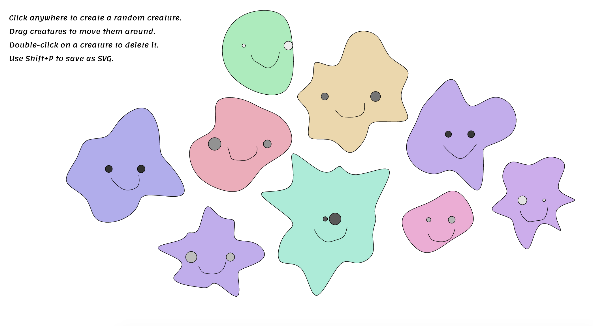

# IDEO-pop-quiz

"Make a quick little something your teenage self would think is totally awesome."

### Creatures Generator
This is a simple creatures generator.
Built using paper.js

As a teenager, I loved sketching imaginary friend all the time.
I built a fun little app that creates those creatures, and lets the user move them around, delete them, or export the result as an SVG file.

This is live at [www.jasrub.com/IDEO-pop-quiz](http://www.jasrub.com/IDEO-pop-quiz/)
